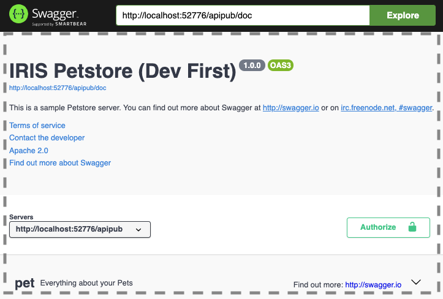
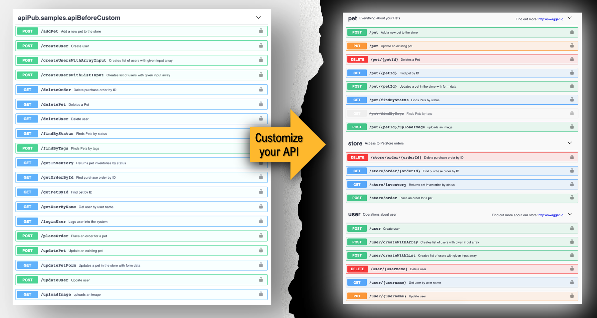

# IRIS ApiPub

IRIS ApiPub é um projeto [Open Source](https://en.wikipedia.org/wiki/Open_source), de iniciativa pessoal, que tem como principal objetivo **publicar** automaticamente **API's RESTful** criadas com a tecnologia [Intersystems IRIS](https://www.intersystems.com/try-intersystems-iris-for-free/), da forma mais simples e rápida possível, utilizando o padrão [Open API Specification](https://swagger.io/specification/) (OAS) versão 3.0.  

Ele permite que o usuário foque principalmente na **implementação** das API’s (Web Methods), automatizando os demais aspectos relacionados a **exposição, execução, documentação e monitoramento** dos serviços.

Este projeto também inclui uma implementação de exemplo completa (**apiPub.samples.api**) do *sample* [Swagger Petstore](https://app.swaggerhub.com/apis/Colon-Org/Swagger-PetStore-3.0/1.1), utilizado como *sample* oficial do [swagger](https://swagger.io/). 


## Faça um teste com os teus serviços SOAP já existentes 
Se você já possui serviços SOAP publicados, você pode testar a sua publicação com Rest/JSON com OAS 3.0.


Ao publicar métodos com tipos complexos é necessário que a classe do objeto seja uma subclasse de %XML.Adaptor. Desta maneira serviços SOAP já existentes são automaticamente compatíveis.


## **Instalação**

Importe o pacote apiPub_vx.xml no namespace desejado via terminal.

```
zn "USER"
Do $System.OBJ.Load("/path/apiPub_vx.xml","ck")
```
Ou através do portal de Administração


## **Publique sua API no padrão OAS 3.0 com apenas 3 passos:**

## Passo 1  
Defina a classe de implementação das tuas API’s e **rotule** os métodos com o atributo [WebMethod]

*Caso você já possua alguma implementação com WebServices esse passo não é necessário.*

## Passo 2
Crie uma **subclasse** de apiPub.core.service e aponte a propriedade DispatchClass para a sua classe de Implementação criada anteriormente. Informe também o path de documentação OAS 3.0. Se desejar, aponte para a classe apiPub.samples.api (PetStore).


## Passo 3
Crie uma Aplicação Web e aponte a classe de Dispatch para a classe de serviço criada anteriomente.


## Utilize o Swagger
Com o [iris-web-swagger-ui](https://openexchange.intersystems.com/package/iris-web-swagger-ui) é possível expor a especificação do teu serviço. Basta apontar para o path de documentação e ... **VOILÁ!!**  


## Defina o cabeçalho da especificação OAS


Há duas maneiras de definir o cabeçalho OAS 3.0: 

A primeira é através da criação de um bloco JSON XDATA nomeado como apiPub na classe de implementação. Este método permite que se tenha mais de uma Tag e a modelagem é compatível com o padrão OAS 3.0. 
```
XData apiPub [ MimeType = application/json ]
{
    {
        "info" : {
            "description" : "This is a sample Petstore server.  You can find\nout more about Swagger at\n[http://swagger.io](http://swagger.io) or on\n[irc.freenode.net, #swagger](http://swagger.io/irc/).\n",
            "version" : "1.0.0",
            "title" : "IRIS Petstore (Dev First)",
            "termsOfService" : "http://swagger.io/terms/",
            "contact" : {
            "email" : "apiteam@swagger.io"
            },
            "license" : {
            "name" : "Apache 2.0",
            "url" : "http://www.apache.org/licenses/LICENSE-2.0.html"
            }
        },
        "tags" : [ {
            "name" : "pet",
            "description" : "Everything about your Pets",
            "externalDocs" : {
            "description" : "Find out more",
            "url" : "http://swagger.io"
            }
        }, {
            "name" : "store",
            "description" : "Access to Petstore orders"
        }, {
            "name" : "user",
            "description" : "Operations about user",
            "externalDocs" : {
            "description" : "Find out more about our store",
            "url" : "http://swagger.io"
            }
        } ]
    }
}
```
A segunda maneira é através da definição de parâmetros na classe de implementação, assim como no exemplo a seguir:

```
Parameter SERVICENAME = "My Service";

Parameter SERVICEURL = "http://localhost:52776/apipub";

Parameter TITLE As %String = "REST to SOAP APIs";

Parameter DESCRIPTION As %String = "APIs to Proxy SOAP Web Services via REST";

Parameter TERMSOFSERVICE As %String = "http://www.intersystems.com/terms-of-service/";

Parameter CONTACTNAME As %String = "John Doe";

Parameter CONTACTURL As %String = "https://www.intersystems.com/who-we-are/contact-us/";

Parameter CONTACTEMAIL As %String = "support@intersystems.com";

Parameter LICENSENAME As %String = "Copyright InterSystems Corporation, all rights reserved.";

Parameter LICENSEURL As %String = "http://docs.intersystems.com/latest/csp/docbook/copyright.pdf";

Parameter VERSION As %String = "1.0.0";

Parameter TAGNAME As %String = "Services";

Parameter TAGDESCRIPTION As %String = "Legacy Services";

Parameter TAGDOCSDESCRIPTION As %String = "Find out more";

Parameter TAGDOCSURL As %String = "http://intersystems.com";
```
## Customize as tuas API's


É possível customizar vários aspectos das API's, como *paths* e *verbos http*. Para tal, é necessária a utilização de uma notação específica, definida no comentário do método a ser customizado. 

Sintaxe:
>/// @apiPub[*assignment clause*]  
[*Method/ClassMethod*] *methodName(params as type) As returnType* {  
>    
>}

Todas estas customizações dadas como exemplo nesta documentação estão disponíveis na classe [apiPub.samples.api](/samples/api.cls).

## Customizando os Verbos das API's
Quando não há nenhum tipo complexo como parâmetro de entrada ou retorno, apiPub atribui automaticamente o verbo como *Get*. Caso contrário é atribuído o verbo *Post*. 

Caso se queira customizar o método adiciona-se a seguinte linha nos comentários do método.

>/// @apiPub[verb="*verb*"]

Onde *verb* pode ser **get, post, put, delete ou patch**. 

## Customizando os Caminhos (Paths) das API's
Esta ferramenta atribui automaticamente os *paths* ou o roteamento para os *Web Methods*. Ele utiliza como padrão o nome do método como *path*.

Caso se queira customizar o **path** adiciona-se a seguinte linha nos comentários do método.

>/// @apiPub[path="*path*"]

Onde *path* pode ser qualquer valor precedido com barra, desde que não conflita com outro *path* na mesma classe de implementação. 

Exemplo:
>/// @apiPub[path="/pet"]

Outro uso bastante comum do path é definir um ou mais parâmetros no próprio path. Para tal, é necessário que o nome do parâmetro definido no método esteja entre chaves. 

Exemplo:
>/// @apiPub[path="/pet/{petId}"]  
Method getPetById(petId As %Integer) As apiPub.samples.Pet [ WebMethod ]   
{  
}

Exemplo quando o nome do parâmetro difere do nome do parametro exposto:
>/// @apiPub[path="/pet/{petId}"]  
/// @apiPub[params.pId.name="petId"]  
Method getPetById(pId As %Integer) As apiPub.samples.Pet [ WebMethod ]   
{  
}

## Customizando nomes e outras funcionalidades dos parametros
Pode-se customizar vários aspectos de cada parâmetro de entrada e saída dos métodos, como por exemplo os nomes e as descrições que serão expostas para cada parâmetro.

Para se customizar os parâmetros utiliza-se a seguinte notação

>/// @apiPub[params.*paramId.property*="*value*"]

ou para respostas:

>/// @apiPub[*response.property*="*value*"]

Exemplo:
>/// @apiPub[params.pId.name="petId"]  
/// @apiPub[params.pId.description="ID of pet to return"]

Neste caso, está sendo atribuido o nome *petId* e a descrição *ID of pet to return* para o parâmetro definido como *pId*

## Monitore a chamada das suas API's com o IRIS Analytics 
*pending*


